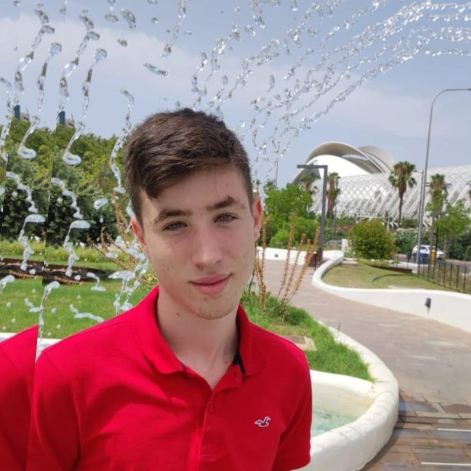

<!-- Header (*Temporary*) -->
# José Luis López

<!-- Main Body [Image & Description] -->

Hi there! I'm **José Luis López** - but you can call me **Joselu** 👋.  
I am a Computer Science and Engineering student from **Spain 🇪🇸**.  
Passionate about **Artificial Intelligence**🤖 and **Cybersecurity**🔒, always looking for ways to connect creativity with technology💻. Currently exploring **Web and App Development**, and constantly learning **through projects and hackathons**💼. Driven by curiosity and continuous learning, I enjoy tackling challenges that bring together software, data, security and others.  
Beyond the screen, **aviation🛩️ and fitness🏋️‍♂️** keep me inspired and motivated.  

<!-- Main Body [Social Media] -->
### 🌐 **My Social Media**

<!-- Main Body [My Technologies] -->
### 🧰 **Working With**

<!-- Main Body [My Working Projects] -->
### ⚙️ **Working On**

- [dev-utils](https://github.com/tuusuario/dev-utils) — Conjunto de herramientas CLI para automatización de tareas.  
- [portfolio-template](https://github.com/tuusuario/portfolio-template) — Plantilla moderna para portfolios personales con Next.js.  
- [api-starter](https://github.com/tuusuario/api-starter) — Base para APIs REST con Node.js, Express y TypeScript.  

<!-- Main Body [Statiscics] -->
### 📊 **My Statistics**

  
  

---> 
